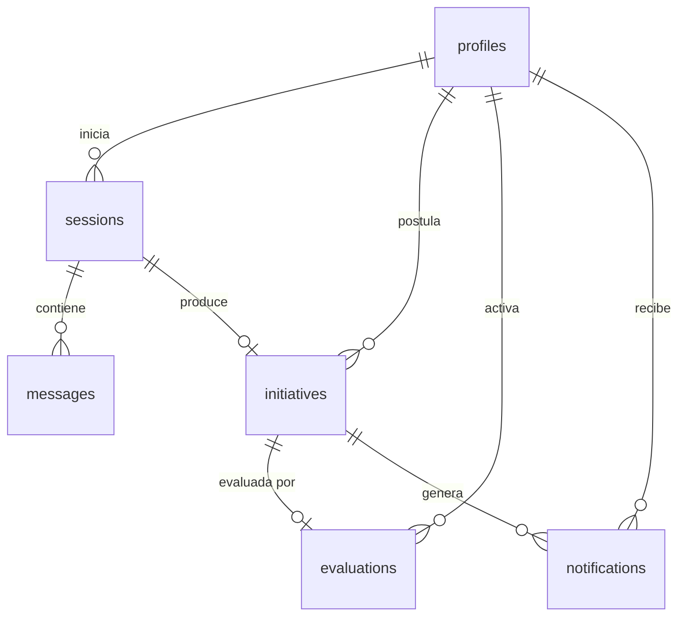

# Domain Model: Plataforma de Innovacion Elecmetal

## Diagrama Entidad-Relacion



## Entidades

### profiles
Perfil de usuario vinculado a `auth.users` de Supabase Auth.

| Atributo | Tipo | Null | Default | Notas |
|----------|------|------|---------|-------|
| id | UUID | NO | — | PK. Mismo ID que Supabase Auth |
| full_name | TEXT | NO | — | Nombre completo |
| role | TEXT | NO | 'postulante' | postulante, directora, admin |
| avatar_url | TEXT | SI | — | URL del avatar |
| created_at | TIMESTAMPTZ | NO | now() | |
| updated_at | TIMESTAMPTZ | NO | now() | |

**Constraints**: `pk_profiles`, `ck_profiles_role`

### sessions
Sesion de chat entre usuario y agente IA. Clara y Analista de Oportunidad comparten esta estructura; se diferencian por `agent_type`.

| Atributo | Tipo | Null | Default | Notas |
|----------|------|------|---------|-------|
| id | BIGINT | NO | GENERATED AS IDENTITY | PK |
| user_id | UUID | NO | — | FK → profiles |
| agent_type | TEXT | NO | — | clara, analista_oportunidad |
| status | TEXT | NO | 'active' | active, completed, abandoned |
| title | TEXT | SI | — | Titulo sidebar |
| started_at | TIMESTAMPTZ | NO | now() | |
| ended_at | TIMESTAMPTZ | SI | — | |
| created_at | TIMESTAMPTZ | NO | now() | |
| updated_at | TIMESTAMPTZ | NO | now() | |

**Constraints**: `pk_sessions`, `fk_sessions_profiles`, `ck_sessions_agent_type`, `ck_sessions_status`
**Indexes**: `idx_sessions_user_id`, `idx_sessions_status`

### messages
Mensaje individual en una sesion de chat. Inmutable una vez creado.

| Atributo | Tipo | Null | Default | Notas |
|----------|------|------|---------|-------|
| id | BIGINT | NO | GENERATED AS IDENTITY | PK |
| session_id | BIGINT | NO | — | FK → sessions (CASCADE) |
| role | TEXT | NO | — | user, assistant, system |
| content | TEXT | NO | — | Contenido del mensaje |
| metadata | JSONB | SI | — | Tokens, bloque DBI, etc. |
| created_at | TIMESTAMPTZ | NO | now() | |

**Constraints**: `pk_messages`, `fk_messages_sessions`, `ck_messages_role`
**Indexes**: `idx_messages_session_id`, `idx_messages_created_at`

### initiatives
Postulacion de innovacion. El DBI generado por Clara se parsea a estos 25 campos estructurados. Se accede siempre como unidad.

| Atributo | Tipo | Null | Notas |
|----------|------|------|-------|
| id | BIGINT | NO | PK |
| session_id | BIGINT | SI | FK → sessions (SET NULL) |
| user_id | UUID | NO | FK → profiles (RESTRICT) |
| status | TEXT | NO | Estado: dbi_generado → persistido → notificado → en_evaluacion → evaluado → validado → veredicto |
| initiative_code | TEXT | NO | UNIQUE. Formato: INI-AAAA-NNN |
| title | TEXT | NO | Titulo del DBI |
| initiative_type | TEXT | NO | interna, externa |
| postulation_date | DATE | NO | Fecha de postulacion |
| area | TEXT | NO | Area del postulante |
| applicant_name | TEXT | NO | Nombre del postulante |
| problem | TEXT | NO | Bloque A |
| solution | TEXT | NO | Bloque B.1 |
| economic_impact | TEXT | SI | Bloque B.2 |
| trl | TEXT | SI | Bloque B.3: TRL 1-2/3-4/5-6/7-9 |
| scalability | TEXT | SI | Bloque B.4: Local/Interna/Externa |
| internal_client | TEXT | SI | Bloque C |
| external_client | TEXT | SI | Bloque C |
| crl | TEXT | SI | Bloque C: CRL 1-4 |
| sponsor | TEXT | SI | Bloque E |
| internal_team | TEXT | SI | Bloque E |
| external_team | TEXT | SI | Bloque E |
| estimated_duration | TEXT | SI | Bloque E |
| main_doubt | TEXT | SI | Bloque F |
| key_condition | TEXT | SI | Bloque F |
| value_capture | TEXT | SI | Bloque F: ahorro/venta/competitividad/nuevo negocio/no claro |
| brl | TEXT | SI | Bloque F: BRL 1-4 |
| technical_milestones | TEXT | SI | Bloque G |
| financial_milestones | TEXT | SI | Bloque G |
| return_horizon | TEXT | SI | Bloque G: 0-6/6-12/12-18/18-24/+24/no se |
| strategic_alignment | TEXT | SI | Bloque D: asignado por equipo innovacion |
| dbi_raw_text | TEXT | SI | Texto original del DBI |
| created_at | TIMESTAMPTZ | NO | |
| updated_at | TIMESTAMPTZ | NO | |

**Constraints**: `pk_initiatives`, `fk_initiatives_sessions`, `fk_initiatives_profiles`, `uq_initiatives_code`, 7 CHECKs para status, type, trl, scalability, crl, brl, return_horizon, value_capture
**Indexes**: `idx_initiatives_user_id`, `idx_initiatives_session_id`, `idx_initiatives_status`

### evaluations
Evaluacion IA de una iniciativa. Relacion 1:1 con initiatives. Los resultados se almacenan en JSONB porque las columnas 26-38 del Evaluador no tienen esquema fijo definido.

| Atributo | Tipo | Null | Notas |
|----------|------|------|-------|
| id | BIGINT | NO | PK |
| initiative_id | BIGINT | NO | FK → initiatives (CASCADE, UNIQUE) |
| activated_by | UUID | NO | FK → profiles (RESTRICT) |
| status | TEXT | NO | pending, in_progress, completed |
| results | JSONB | SI | Columnas 26-38 flexibles |
| reviewed_by | UUID | SI | FK → profiles (SET NULL) |
| reviewed_at | TIMESTAMPTZ | SI | |
| veredicto | TEXT | SI | aprobada, rechazada, pendiente |
| created_at | TIMESTAMPTZ | NO | |
| updated_at | TIMESTAMPTZ | NO | |

**Constraints**: `pk_evaluations`, `fk_evaluations_initiatives`, `fk_evaluations_activated_by`, `fk_evaluations_reviewed_by`, `uq_evaluations_initiative`, `ck_evaluations_status`, `ck_evaluations_veredicto`
**Indexes**: `idx_evaluations_activated_by`

### agent_configs
Configuracion versionada de agentes IA. Sin FK a tablas operativas — la aplicacion referencia agentes por `agent_name`.

| Atributo | Tipo | Null | Notas |
|----------|------|------|-------|
| id | BIGINT | NO | PK |
| agent_name | TEXT | NO | clara, analista_oportunidad, evaluador |
| version | TEXT | NO | v5.4, v2 |
| prompt_text | TEXT | NO | Prompt (resumen o completo) |
| base_knowledge | TEXT | SI | Path a archivo de conocimiento |
| skill_file | TEXT | SI | Path a skill (.skill) |
| is_active | BOOLEAN | NO | Solo una version activa por agente |
| created_at | TIMESTAMPTZ | NO | |
| updated_at | TIMESTAMPTZ | NO | |

**Constraints**: `pk_agent_configs`, `uq_agent_configs_name_version`
**Indexes**: `idx_agent_configs_agent_name`, `idx_agent_configs_is_active` (partial: WHERE is_active = true)

### notifications
Registro de notificaciones enviadas. No envia el email — solo registra que se envio.

| Atributo | Tipo | Null | Notas |
|----------|------|------|-------|
| id | BIGINT | NO | PK |
| initiative_id | BIGINT | NO | FK → initiatives (CASCADE) |
| recipient_user_id | UUID | NO | FK → profiles (CASCADE) |
| notification_type | TEXT | NO | receipt_to_applicant, notice_to_director |
| status | TEXT | NO | pending, sent, failed |
| sent_at | TIMESTAMPTZ | SI | |
| metadata | JSONB | SI | |
| created_at | TIMESTAMPTZ | NO | |

**Constraints**: `pk_notifications`, `fk_notifications_initiatives`, `fk_notifications_profiles`, `ck_notifications_type`, `ck_notifications_status`
**Indexes**: `idx_notifications_initiative_id`, `idx_notifications_recipient_user_id`

## Relaciones

| Desde | Hasta | Cardinalidad | FK | ON DELETE |
|-------|-------|-------------|-----|-----------|
| profiles | sessions | 1:N | sessions.user_id | CASCADE |
| profiles | initiatives | 1:N | initiatives.user_id | RESTRICT |
| profiles | evaluations | 1:N | evaluations.activated_by | RESTRICT |
| profiles | evaluations | 1:N | evaluations.reviewed_by | SET NULL |
| profiles | notifications | 1:N | notifications.recipient_user_id | CASCADE |
| sessions | messages | 1:N | messages.session_id | CASCADE |
| sessions | initiatives | 1:0..1 | initiatives.session_id | SET NULL |
| initiatives | evaluations | 1:0..1 | evaluations.initiative_id | CASCADE |
| initiatives | notifications | 1:N | notifications.initiative_id | CASCADE |

## Maquina de Estados

```
dbi_generado → persistido → notificado → en_evaluacion → evaluado → validado → veredicto
```

| Estado | Disparador | Actor |
|--------|-----------|-------|
| dbi_generado | Clara genera DBI | Clara (IA) |
| persistido | Sistema parsea DBI y guarda | Sistema |
| notificado | Mail enviado a postulante + directora | Sistema |
| en_evaluacion | Directora activa Evaluador | Directora |
| evaluado | Evaluador genera resultados | Evaluador (IA) |
| validado | Directora revisa resultados | Directora |
| veredicto | Deomite decide | Deomite |

## Listas Controladas

### TRL
- `TRL 1-2`: Solo una idea
- `TRL 3-4`: Concepto con alguna prueba
- `TRL 5-6`: Prototipo probado en condiciones reales
- `TRL 7-9`: Validado en produccion

### CRL
- `CRL 1`: Suposicion, sin contacto con cliente
- `CRL 2`: Interes declarado
- `CRL 3`: Participo en diseno/prueba
- `CRL 4`: Ya lo usa

### BRL
- `BRL 1`: Modelo de negocio no claro
- `BRL 2`: Hipotesis sin validar
- `BRL 3`: Estimaciones fundadas
- `BRL 4`: Validado en piloto

### Escalabilidad
- `Local`: Impacto en area/planta especifica
- `Interna`: Impacto en multiples areas de Elecmetal
- `Externa`: Impacto en clientes/mercados externos

### Horizonte de Retorno
- `0-6`, `6-12`, `12-18`, `18-24`, `+24` meses, `no se`

### Value Capture
- `ahorro`: Reduccion de costos
- `venta`: Incremento de ingresos
- `competitividad`: Mejora de posicion competitiva
- `nuevo negocio`: Nueva linea de negocio
- `no claro`: No se sabe aun

## Decisiones de Diseno

1. **`profiles` extiende Supabase Auth**: Supabase gestiona `auth.users`. `public.profiles` agrega rol, nombre y avatar. Un trigger `handle_new_user()` crea el perfil automaticamente al registrarse.
2. **25 columnas en `initiatives`**: El DBI se lee/escribe siempre como unidad. Si en el futuro los campos cambian frecuentemente, migrar a modelo EAV o JSONB.
3. **`evaluations.results` como JSONB**: Las columnas 26-38 del Evaluador no tienen esquema fijo. JSONB permite flexibilidad. Cuando el esquema se estabilice, extraer columnas propias.
4. **`agent_configs` sin FK a tablas operativas**: Los agentes se referencian por `agent_name` en codigo. Cambiar un prompt no requiere alterar registros historicos.
5. **`sessions` cubre Clara y Analista**: Ambos agentes comparten estructura de chat. `agent_type` los diferencia. Agregar un nuevo agente conversacional no requiere nueva tabla.
6. **`notifications` es registro, no sistema de envio**: El backend lee registros pending y dispara los envios. La tabla audita que se envio, a quien, y si fallo.
